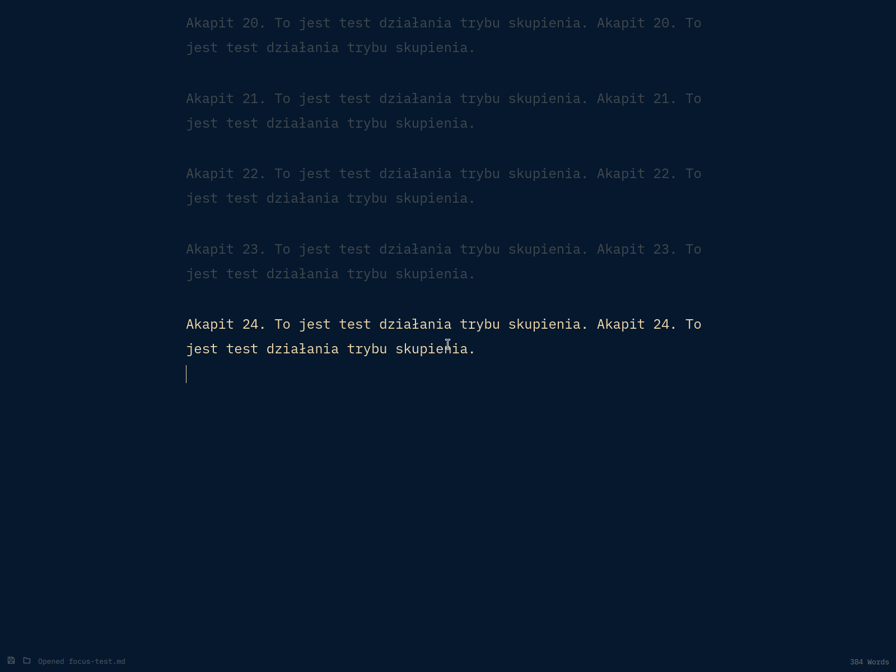

# Omawrite — Focus Mode

This is a personal fork of [Omawrite](https://github.com/omacom/omawrite) that adds a Typewriter Scroll-style focus mode. The original project and MIT license remain credited below.

## Focus Mode changes

- The paragraph containing the caret stays at full text brightness. Paragraphs above and below it use 25% of the theme foreground blended over the page background (75% dimming). Blank lines separate paragraphs, including whitespace-only lines.
- The active paragraph stays near the vertical center while typing or moving the caret to an earlier paragraph. A trailing newline keeps the preceding paragraph active until a new paragraph is started.
- `Super+F` toggles focus mode and Omawrite's fullscreen together. `F11` still toggles fullscreen independently.
- On Omarchy, the installer scopes `Super+F` to Omawrite. In other windows, it keeps Hyprland's usual fullscreen action.



## Install this fork on Omarchy

The installer builds from source and installs only into your home directory. It leaves `/usr/bin/omawrite` and every system-managed package file untouched.

Requirements: `git`, `qmake6`, `make`, a C++17 compiler, and the Qt 6 modules listed below. The regular Omawrite package can remain installed.

```sh
git clone https://github.com/mkruszyniak-omarchy/omawrite-focus-mode.git
cd omawrite-focus-mode
./bin/install-focus
```

The script installs the executable at `~/.local/opt/omawrite-focus/omawrite`, creates a user-level `omawrite.desktop` entry, and updates `~/.config/hypr/bindings.lua` if that file exists. It backs up an existing user desktop entry and makes a timestamped backup of `bindings.lua` before editing it. Hyprland is reloaded and checked for configuration errors. Re-running the installer updates the same marked binding block and replaces the executable atomically, even if Omawrite is running.

The usual Omarchy `Super+Shift+W` shortcut and application launcher then open this fork. Open a document and press `Super+F` to enter or leave Focus Mode.

To remove this local installation and restore any previous user desktop entry:

```sh
./bin/uninstall-focus
```

The uninstall script removes only its marked Hyprland binding block and local executable. Omarchy's packaged Omawrite remains available.

To run the project tests, use `./bin/test`.

## Thank you, DHH

Dziękuję DHH za niesamowity, mindblowing operating system, który pozwala zrobić wszystko, o czym tylko się przyśni!!!

Thank you, DHH, for an amazing, mind-blowing operating system that lets me build anything I can dream of!

## Original Omawrite

A dead-simple Markdown writing app built with Qt Quick and C++ that automatically follows system dark/light mode.


## Install

Install via the Omarchy Package Repository via the `omawrite` package. It's installed by default in new installations of Omarchy (from Quattro forward).

## Shortcuts

- `Ctrl+S` saves. Unsaved documents use the XDG desktop portal file picker.
- `Ctrl+Shift+S` saves as.
- `Ctrl+O` opens a Markdown file through the portal picker.
- `Ctrl+P` opens the system print dialog.
- `Ctrl+N` opens a new Omawrite window.
- `Ctrl+Z`, `Ctrl+Shift+Z`, and `Ctrl+Y` handle undo and redo.
- `Super+F` toggles Focus Mode and fullscreen. Qt maps this key as `Meta+F`.
- `F11` toggles fullscreen independently.
- `Ctrl+F` searches the document. Use `Enter` or `Ctrl+G` for the next match and `Shift+Enter` for the previous match.
- `Ctrl+H` opens find and replace.
- `Ctrl+B`, `Ctrl+I`, and `Ctrl+K` insert bold, italic, and link Markdown.
- `Ctrl+?` shows the keyboard shortcut reference.

Unsaved drafts are recovered after an abnormal exit. Omawrite also watches open files
and warns before an external change can replace local work.

Text follows the desktop text size — `omarchy display text size`, or GNOME's
`text-scaling-factor` — and re-flows without a restart. The default of 12px leaves
Omawrite at the size it is designed around; larger and smaller sizes scale from there.

## Requirements

- Qt 6: `qt6-base`, `qt6-declarative`, `qt6-quickcontrols2`
- `xdg-desktop-portal` and a portal backend

The iA Writer Mono font is bundled under the SIL Open Font License 1.1; see
`fonts/OFL.txt`. The font is copyright Information Architects Inc. and based on
IBM Plex, copyright IBM Corp.
